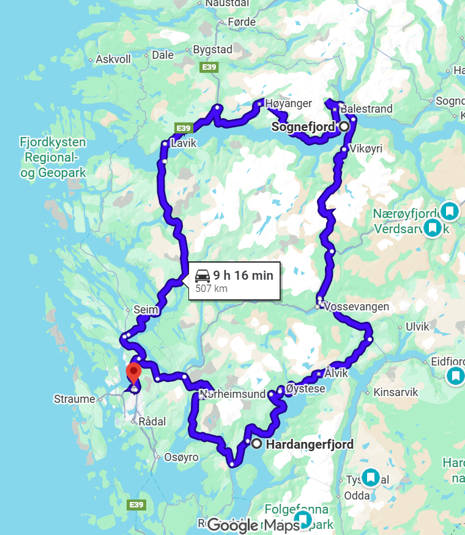
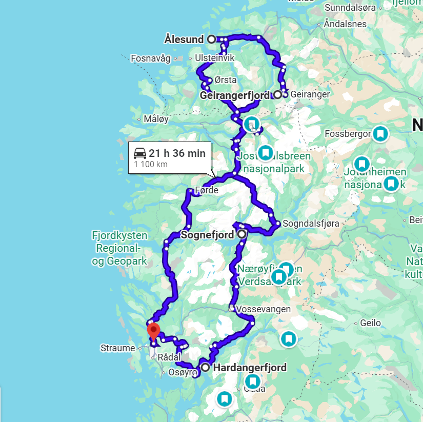
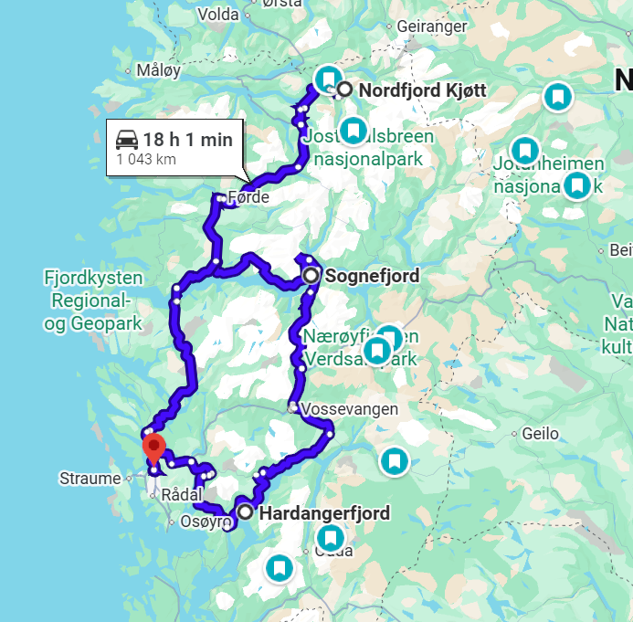

# Varianty trasy (12 nocí, Bergen)

## Varianta A: Jižní fjordy (Hardangerfjord + Sognefjord)
1) Stručné shrnutí (2–3 věty): Tato varianta drží trasu v jihozápadním Norsku a staví na dvou hlavních fjordech s krátkými přesuny. Je to nejméně náročné řešení se stabilními základnami a dostatkem času na výlety a počasí.
2) Rozpis nocí po oblastech (součet = 12 nocí):
   - Bergen a okolí: 1 noc
   - Hardangerfjord (např. Eidfjord/Ulvik/Utne): 4 noci
   - Sognefjord (např. Aurland/Lærdal/Balestrand): 5 nocí
   - Bergen a okolí: 2 noci
3) Logika přejezdů (kolik hlavních přesunů, typická délka): 3 hlavní přesuny; typicky 2–5 h na přesun, s možností rozdělit cestu zastávkami.
4) Vhodnost pro elektroauto: ANO. Kratší vzdálenosti, hustší infrastruktura v hlavním turistickém pásu a snadná kontrola dojezdu.
5) Hlavní rizika: počasí na fjordech a vyhlídkách, víkendové špičky, omezení trajekty.

### Orientační mapa trasy
- Tvar trasy: kompaktní okruh.
- Hlavní body v pořadí: Bergen → Hardangerfjord → Sognefjord → Bergen.

- Google Maps: https://www.google.com/maps/dir/Bergen,+Norsko/Hardangerfjord,+Norsko/Sognefjord,+Norsko/Bergen,+Norsko/@60.8003255,4.7209757,8z/data=!4m26!4m25!1m5!1m1!1s0x46390d4966767d77:0x9e42a03eb4de0a08!2m2!1d5.3220544!2d60.3912628!1m5!1m1!1s0x463c28bbd358360f:0x2f1888316462cdad!2m2!1d6.0582495!2d60.2253048!1m5!1m1!1s0x46161d7f3f72c789:0x6b5906b81323cb38!2m2!1d6.5806337!2d61.1554244!1m5!1m1!1s0x46390d4966767d77:0x9e42a03eb4de0a08!2m2!1d5.3220544!2d60.3912628!3e0?entry=ttu&g_ep=EgoyMDI1MTIwOS4wIKXMDSoASAFQAw%3D%3D

### Signaturní must-see této varianty
- **Hardangerfjord** — sady, fjordy, klidnější tempo
- **Vøringfossen** — ikonický vodopád u Hardangerviddy
- **Hardangervidda** — náhorní planina a horské cesty
- **Trolltunga** — nejznámější hike regionu
- **Folgefonna** — ledovec blízko fjordu
- **Steinsdalsfossen** — vodopád dostupný od silnice

### Co tato varianta NEOBSAHUJE
- **Geirangerfjord a Ørnevegen** — patří do varianty B
- **Ålesund a Sunnmøre Alps** — patří do varianty B
- **Trollstigen** — patří do varianty B
- **Jostedalsbreen a Loen Skylift** — patří do varianty C

## Varianta B: Velký okruh (náročnější, delší přejezdy)
1) Stručné shrnutí (2–3 věty): Velký okruh přidává severnější fjordy a pohoří, aby se vidělo více rozmanitých oblastí. Je to trasa s více základnami a častějšími dlouhými přesuny, vhodná spíš pro vyšší toleranci k jízdě.
2) Rozpis nocí po oblastech (součet = 12 nocí):
   - Bergen a okolí: 1 noc
   - Hardangerfjord: 2 noci
   - Sognefjord: 3 noci
   - Nordfjord / Geirangerfjord: 3 noci
   - Sunnmøre / Ålesund / okolní pobřežní oblast: 2 noci
   - Bergen a okolí: 1 noc
3) Logika přejezdů (kolik hlavních přesunů, typická délka): 5 hlavních přesunů; často 4–7 h na přesun, některé dny mohou být prakticky přesunové.
4) Vhodnost pro elektroauto: SPÍŠE NE. Délky přesunů a horské úseky zvyšují spotřebu a zvedají riziko stresu z dojezdu.
5) Hlavní rizika: únava z dlouhých přesunů, počasí v horských přechodech, závislost na trajektech, méně volných dnů.

### Orientační mapa trasy
- Tvar trasy: velký okruh, protáhlý do severu.
- Hlavní body v pořadí: Bergen → Hardangerfjord → Sognefjord → Nordfjord/Geirangerfjord → Sunnmøre/Ålesund → Bergen.

- Google Maps: https://www.google.com/maps/dir/Bergen,+Norsko/Hardangerfjord,+Norsko/Sognefjord,+Norsko/Geirangerfjord,+Stranda+Municipality,+Norsko/%C3%85lesund,+Norsko/Bergen,+Norsko/@61.365566,3.7480872,7z/data=!4m38!4m37!1m5!1m1!1s0x46390d4966767d77:0x9e42a03eb4de0a08!2m2!1d5.3220544!2d60.3912628!1m5!1m1!1s0x463c28bbd358360f:0x2f1888316462cdad!2m2!1d6.0582495!2d60.2253048!1m5!1m1!1s0x46161d7f3f72c789:0x6b5906b81323cb38!2m2!1d6.5806337!2d61.1554244!1m5!1m1!1s0x46169d427b268c51:0xb8c99540dcc397fe!2m2!1d7.0940817!2d62.101506!1m5!1m1!1s0x4616da471047fb4b:0xe82562ee3bc08fea!2m2!1d6.1494821!2d62.4722284!1m5!1m1!1s0x46390d4966767d77:0x9e42a03eb4de0a08!2m2!1d5.3220544!2d60.3912628!3e0?entry=ttu&g_ep=EgoyMDI1MTIwOS4wIKXMDSoASAFQAw%3D%3D

### Signaturní must-see této varianty
- **Geirangerfjord** — ikonický fjordový vrchol
- **Ørnevegen** — vyhlídky nad Geirangerem
- **Dalsnibba** — vysokohorské panorama
- **Trollstigen** — slavná horská silnice
- **Ålesund** — secesní město na pobřeží
- **Sunnmøre Alps** — ostré hřebeny a fjordy
- **Gamle Strynefjellsvegen** — historická horská silnice

### Co tato varianta NEOBSAHUJE
- **Trolltunga a Hardangerfjord naplno** — patří do varianty A
- **Hardangervidda a Folgefonna** — patří do varianty A
- **Jostedalsbreen a Loen Skylift** — patří do varianty C
- **Klidnější tempo s krátkými přesuny** — patří do varianty A

## Varianta C: Fjordový trojúhelník (vyvážený kompromis)
1) Stručné shrnutí (2–3 věty): Vyvážená trasa mezi jihozápadem a severnějším pobřežím, bez extrémně dlouhých přejezdů. Stále nabízí rozmanitost fjordů a hor, ale s rozumným tempem a 4 základnami.
2) Rozpis nocí po oblastech (součet = 12 nocí):
   - Bergen a okolí: 1 noc
   - Hardangerfjord: 3 noci
   - Sognefjord (vnitrozemí + fjordy): 4 noci
   - Nordfjord / Stryn / Loen: 3 noci
   - Bergen a okolí: 1 noc
3) Logika přejezdů (kolik hlavních přesunů, typická délka): 4 hlavní přesuny; typicky 3–6 h, s možností rozdělit cestu zastávkami.
4) Vhodnost pro elektroauto: SPÍŠE ANO. Přesuny jsou střední délky a oblasti mají rozumné pokrytí nabíječek, ale je potřeba plánovat.
5) Hlavní rizika: proměnlivé počasí ve vyšších polohách, jeden až dva delší přejezdy, tlak na čas pokud se přidá moc výletů.

### Orientační mapa trasy
- Tvar trasy: trojúhelník mezi třemi fjordovými oblastmi.
- Hlavní body v pořadí: Bergen → Hardangerfjord → Sognefjord → Nordfjord/Stryn/Loen → Bergen.

- Google Maps: https://www.google.com/maps/dir/Bergen,+Norsko/Sognefjord,+Norsko/Hardangerfjord,+Norsko/Nordfjord+Kj%C3%B8tt,+Lovikvegen,+Loen,+Stryn,+Norsko/Bergen,+Norsko/@61.120764,3.8145389,7z/data=!4m32!4m31!1m5!1m1!1s0x46390d4966767d77:0x9e42a03eb4de0a08!2m2!1d5.3220544!2d60.3912628!1m5!1m1!1s0x46161d7f3f72c789:0x6b5906b81323cb38!2m2!1d6.5806337!2d61.1554244!1m5!1m1!1s0x463c28bbd358360f:0x2f1888316462cdad!2m2!1d6.0582495!2d60.2253048!1m5!1m1!1s0x46167dc4d68fd8d5:0xa9eaa4440bbe5970!2m2!1d6.8567794!2d61.8665995!1m5!1m1!1s0x46390d4966767d77:0x9e42a03eb4de0a08!2m2!1d5.3220544!2d60.3912628!3e0?entry=ttu&g_ep=EgoyMDI1MTIwOS4wIKXMDSoASAFQAw%3D%3D

### Signaturní must-see této varianty
- **Jostedalsbreen** — největší pevninský ledovec
- **Briksdalsbreen** — ledovec dostupný krátkou túrou
- **Loen Skylift** — rychlý výstup na výhled
- **Nordfjord** — klidnější fjordové úseky
- **Stryn a okolní jezera** — krajina mezi fjordy a horami
- **Lodalen/Oldedalen** — ledovcová údolí a jezera

### Co tato varianta NEOBSAHUJE
- **Geirangerfjord a Dalsnibba** — patří do varianty B
- **Ålesund a Sunnmøre Alps** — patří do varianty B
- **Trollstigen** — patří do varianty B
- **Trolltunga a Hardangervidda** — patří do varianty A

## Srovnání variant podle ikonických míst

| Ikonické místo / oblast | Varianta A | Varianta B | Varianta C |
|-------------------------|------------|------------|------------|
| Hardangerfjord          | 🟢         | 🟡         | 🟢         |
| Trolltunga              | 🟢         | 🔴         | 🔴         |
| Vøringsfossen           | 🟢         | 🔴         | 🟡         |
| Sognefjord (hlavní část)| 🟢         | 🟡         | 🟢         |
| Nærøyfjord / Flåm       | 🟢         | 🟡         | 🟡         |
| Jostedalsbreen          | 🔴         | 🟡         | 🟢         |
| Loen Skylift            | 🔴         | 🟡         | 🟢         |
| Geirangerfjord          | 🔴         | 🟢         | 🔴         |
| Dalsnibba               | 🔴         | 🟢         | 🔴         |
| Ålesund                 | 🔴         | 🟢         | 🔴         |
| Trollstigen             | 🔴         | 🟢         | 🔴         |

**Legenda:**  
🟢 = zahrnuto  
🟡 = možné / okrajově / s kompromisem  
🔴 = typicky ne
