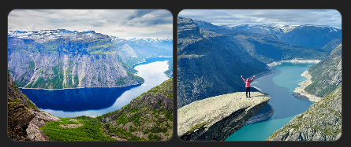
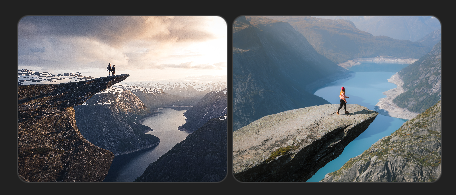
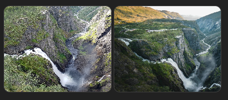
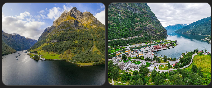
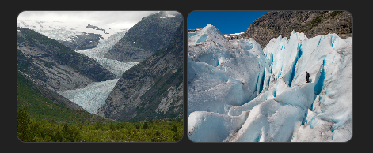
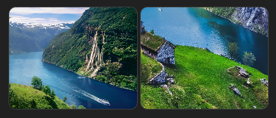
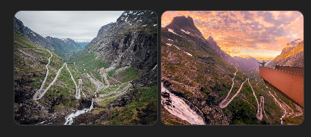
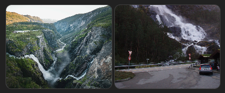
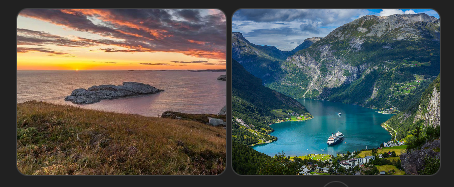

# Ikonická místa – západní Norsko
(podklad pro výběr trasy)

Tento dokument shrnuje ikonická místa použitá ve srovnávací matici variant A / B / C.
Slouží jako referenční katalog, ze kterého se skládá výsledná trasa.

## Katalog z matice variant A / B / C

### Hardangerfjord

Jeden z nejpřístupnějších a nejpestřejších fjordů. Kombinuje vodopády, hory, sady a klidné vesnice.
Vhodný pro pomalejší tempo a hvězdicové výlety.

→ [Google Maps](https://maps.google.com/?q=Hardangerfjord)

Varianty: A, B, C

### Trolltunga

Jedna z nejznámějších skalních vyhlídek v Norsku.
Celodenní fyzicky náročný hike, silný „bucket-list“ zážitek.

→ [Google Maps](https://maps.google.com/?q=Trolltunga)

Varianty: A

### Vøringsfossen

Ikonický vodopád na hraně Hardangerviddy.
Moderní lávky a vyhlídky umožňují bezpečný a intenzivní zážitek.

→ [Google Maps](https://maps.google.com/?q=Voringfossen)

Varianty: A, C

### Sognefjord (hlavní část)

Nejdelší a nejhlubší fjord v Norsku.
Monumentální měřítko krajiny, silný kontrast vůči Hardangerfjordu.

→ [Google Maps](https://maps.google.com/?q=Sognefjord)

Varianty: A, B, C

### Nærøyfjord / Flåm

Úzký a dramatický fjord zapsaný na seznamu UNESCO.
Často kombinován s lodí a návštěvou Flåmu.

→ [Google Maps](https://maps.google.com/?q=Naeroyfjord)

Varianty: A, B, C

### Jostedalsbreen

Největší ledovec na evropské pevnině.
Zastřešuje více přístupných splazů (Nigardsbreen, Briksdalsbreen).

→ [Google Maps](https://maps.google.com/?q=Jostedalsbreen)

Varianty: B, C

### Loen Skylift

Lanovka z fjordu přímo do vysokohorského prostředí.
Rychlý přístup k výhledům bez nutnosti náročné túry.

→ [Google Maps](https://maps.google.com/?q=Loen+Skylift)

Varianty: B, C

### Geirangerfjord

Nejslavnější fjord Norska.
Extrémně fotogenický, ale v sezóně velmi frekventovaný.

→ [Google Maps](https://maps.google.com/?q=Geirangerfjord)

Varianty: B

### Dalsnibba

Vysokohorská vyhlídka dostupná autem.
Panoramatický pohled na Geirangerfjord a okolní hory.

→ [Google Maps](https://maps.google.com/?q=Dalsnibba)

Varianty: B

### Ålesund

Secesní město rozložené na ostrovech.
Kombinace městské architektury a pobřežní krajiny.

→ [Google Maps](https://maps.google.com/?q=Alesund)

Varianty: B

### Trollstigen

Jedna z nejslavnějších horských silnic v Evropě.
Serpentiny, vodopády, vyhlídky – silnice jako zážitek.

→ [Google Maps](https://maps.google.com/?q=Trollstigen)

Varianty: B

## Poznámka k použití dokumentu

Tento soubor je čistý katalog míst (1 místo = 1 sekce).
Nenavrhuje trasu ani pořadí.
Slouží jako zdroj pro matici, výběr varianty a rodinnou diskusi.

## Doplňkový katalog (mimo matici)

### Bergen a blízké okolí

#### Bergen
Brána do fjordů. Přístavní město s atmosférou, dobré na začátek i konec cesty.
→ [Google Maps](https://maps.google.com/?q=Bergen)

Varianty: A, B, C

#### Bryggen
UNESCO historická čtvrť – barevné dřevěné domy, krátká návštěva, silná atmosféra.
→ [Google Maps](https://maps.google.com/?q=Bryggen+Bergen)

Varianty: Žádná

#### Ulriken
Nejvyšší z „městských“ hor. Lanovka + opravdový horský pocit, lepší než Fløyen.
→ [Google Maps](https://maps.google.com/?q=Ulriken)

Varianty: Žádná

### Vodopády

#### Langfossen
Vodopád padající přímo k silnici – nečekaně silný zážitek.
→ [Google Maps](https://maps.google.com/?q=Langfossen)

Varianty: Žádná

### Ledovce a ledovcová krajina

#### Folgefonna
Rozsáhlý ledovec blízko fjordů. Kontrast ledu a zeleně.
→ [Google Maps](https://maps.google.com/?q=Folgefonna)

Varianty: A

#### Bondhusvatnet
Ledovcové jezero s tyrkysovou vodou, krátká nenáročná procházka.
→ [Google Maps](https://maps.google.com/?q=Bondhusvatnet)

Varianty: Žádná

#### Nigardsbreen
Nejpřístupnější splaz Jostedalsbreenu (loďka + krátká túra).
→ [Google Maps](https://maps.google.com/?q=Nigardsbreen)

Varianty: Žádná

### Vyhlídky a ikonická místa

#### Dronningstien
Exponovaná hřebenovka nad Hardangerfjordem. Jeden z top hikeů oblasti.
→ [Google Maps](https://maps.google.com/?q=Dronningstien)

Varianty: Žádná

#### Stegastein
Architektonická vyhlídka nad Aurlandsfjordem. Krátká zastávka, velký efekt.
→ [Google Maps](https://maps.google.com/?q=Stegastein)

Varianty: Žádná

### Hory a silnice jako zážitek

#### Hardangervidda
Největší horská plošina v Evropě. Otevřený prostor, tundra, sobi.
→ [Google Maps](https://maps.google.com/?q=Hardangervidda)

Varianty: A

#### Aurlandsfjellet
Vyhlídková silnice („snow road“), zážitek sám o sobě.
→ [Google Maps](https://maps.google.com/?q=Aurlandsfjellet)

Varianty: Žádná

### Moře a pobřeží

#### Øygarden
Drsné skalnaté pobřeží, oceán, vítr – jiný typ Norska než fjordy.
→ [Google Maps](https://maps.google.com/?q=Oygarden)

Varianty: Žádná

### Typické norské zážitky (nezávislé na místě)

#### Červená chata u vody
Ticho, světlo, večer bez signálu. Silný „paměťový“ moment.

Varianty: Žádná

#### Krátký fjordový trajekt
Ne jako nutnost, ale jako zážitek – pomalost, prostor, klid.

Varianty: Žádná

#### Koupání v ledové vodě
Krátké, intenzivní, nezapomenutelné.

Varianty: Žádná
