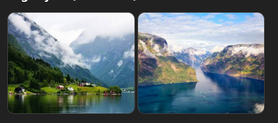
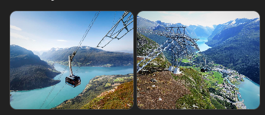
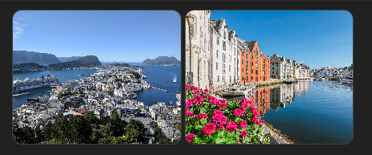
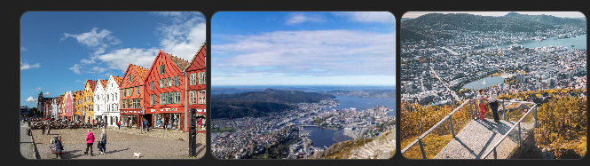
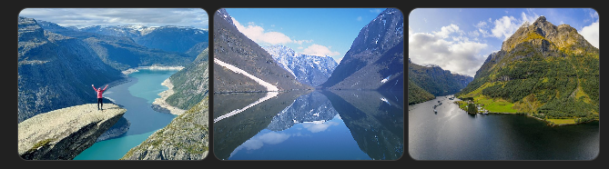
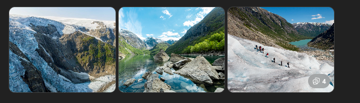
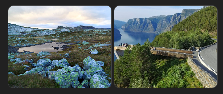
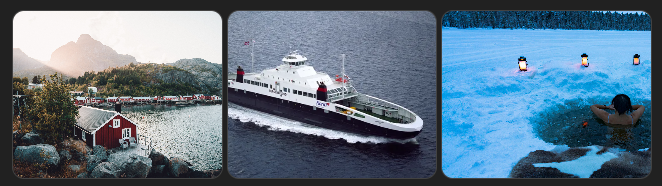

Ikonická místa – západní Norsko (podklad pro výběr trasy)

Tento dokument shrnuje všechna ikonická místa použitá ve srovnávací matici variant A / B / C.
Slouží jako referenční katalog míst, ze kterého se skládá výsledná trasa.

Hardangerfjord

Jeden z nejpřístupnějších a nejpestřejších fjordů. Kombinuje vodopády, hory, sady a klidné vesnice.
Vhodný pro pomalejší tempo a hvězdicové výlety.

📍 https://maps.google.com/?q=Hardangerfjord

Trolltunga

Jedna z nejznámějších skalních vyhlídek v Norsku.
Celodenní fyzicky náročný hike, silný „bucket-list“ zážitek.

📍 https://maps.google.com/?q=Trolltunga

Vøringsfossen

Ikonický vodopád na hraně Hardangerviddy.
Moderní lávky a vyhlídky umožňují bezpečný a intenzivní zážitek.

📍 https://maps.google.com/?q=Vøringsfossen

Sognefjord (hlavní část)

Nejdelší a nejhlubší fjord v Norsku.
Monumentální měřítko krajiny, silný kontrast vůči Hardangerfjordu.

📍 https://maps.google.com/?q=Sognefjord

Nærøyfjord / Flåm

Úzký a dramatický fjord zapsaný na seznamu UNESCO.
Často kombinován s lodí a návštěvou Flåmu.

📍 https://maps.google.com/?q=Naeroyfjord

Jostedalsbreen

Největší ledovec na evropské pevnině.
Zastřešuje více přístupných splazů (Nigardsbreen, Briksdalsbreen).

📍 https://maps.google.com/?q=Jostedalsbreen

Loen Skylift

Lanovka z fjordu přímo do vysokohorského prostředí.
Rychlý přístup k výhledům bez nutnosti náročné túry.

📍 https://maps.google.com/?q=Loen+Skylift

Geirangerfjord

Nejslavnější fjord Norska.
Extrémně fotogenický, ale v sezóně velmi frekventovaný.

📍 https://maps.google.com/?q=Geirangerfjord

Dalsnibba

Vysokohorská vyhlídka dostupná autem.
Panoramatický pohled na Geirangerfjord a okolní hory.

📍 https://maps.google.com/?q=Dalsnibba

Ålesund

Secesní město rozložené na ostrovech.
Kombinace městské architektury a pobřežní krajiny.

📍 https://maps.google.com/?q=Alesund

Trollstigen

Jedna z nejslavnějších horských silnic v Evropě.
Serpentiny, vodopády, vyhlídky – silnice jako zážitek.

📍 https://maps.google.com/?q=Trollstigen

Poznámka k použití dokumentu

Tento soubor je čistý katalog míst (1 místo = 1 sekce).

Nenavrhuje trasu ani pořadí.

Slouží jako zdroj pro matici, výběr varianty a rodinnou diskusi.

Další krok (navrhuji):

z tohoto souboru udělat automatický podklad pro matici

nebo doplnit ke každému místu „typ zátěže“ (čas / fyzička / přejezdy)

případně připravit verzi pro rodinu (jednověté popisy + emoji)

Must-see místa – oblast Bergenu a západní Norsko

Tento dokument shrnuje klíčová místa a zážitky, která dávají cestě do Norska „ten pravý norský efekt“.
Slouží jako společný seznam cílů, ze kterého lze skládat konkrétní trasu (varianty A/B/C).

Bergen & blízké okolí

Bergen

Brána do fjordů. Přístavní město s atmosférou, dobré na začátek i konec cesty.
🔗 https://maps.google.com/?q=Bergen

Bryggen

UNESCO historická čtvrť – barevné dřevěné domy, krátká návštěva, silná atmosféra.
🔗 https://maps.google.com/?q=Bryggen+Bergen

Ulriken

Nejvyšší z „městských“ hor. Lanovka + opravdový horský pocit, lepší než Fløyen.
🔗 https://maps.google.com/?q=Ulriken

Fjordy

Hardangerfjord

Kombinace fjordu, vodopádů a sadů. Velmi fotogenický, přívětivý.
🔗 https://maps.google.com/?q=Hardangerfjord

Sognefjord

Nejdelší a nejhlubší fjord v Norsku. Masivní, syrový, monumentální.
🔗 https://maps.google.com/?q=Sognefjord

Nærøyfjord

Úzký, dramatický fjord (UNESCO). Ideální na krátkou plavbu.
🔗 https://maps.google.com/?q=Nærøyfjord

Vodopády

Vøringsfossen

Ikonický vodopád s moderními lávkami a vyhlídkami.
🔗 https://maps.google.com/?q=Vøringsfossen

Langfossen

Vodopád padající přímo k silnici – nečekaně silný zážitek.
🔗 https://maps.google.com/?q=Langfossen

Ledovce & ledovcová krajina

Folgefonna

Rozsáhlý ledovec blízko fjordů. Kontrast ledu a zeleně.
🔗 https://maps.google.com/?q=Folgefonna

Bondhusvatnet

Ledovcové jezero s tyrkysovou vodou, krátká nenáročná procházka.
🔗 https://maps.google.com/?q=Bondhusvatnet

Jostedalsbreen

Největší ledovec na pevnině Evropy.
🔗 https://maps.google.com/?q=Jostedalsbreen

Nigardsbreen

Nejpřístupnější splaz Jostedalsbreenu (loďka + krátká túra).
🔗 https://maps.google.com/?q=Nigardsbreen

Vyhlídky & ikonická místa

Dronningstien

Exponovaná hřebenovka nad Hardangerfjordem. Jeden z top hikeů oblasti.
🔗 https://maps.google.com/?q=Dronningstien

Stegastein

Architektonická vyhlídka nad Aurlandsfjordem. Krátká zastávka, velký efekt.
🔗 https://maps.google.com/?q=Stegastein

Hory & silnice jako zážitek

Hardangervidda

Největší horská plošina v Evropě. Otevřený prostor, tundra, sobi.
🔗 https://maps.google.com/?q=Hardangervidda

Aurlandsfjellet

Vyhlídková silnice („snow road“), zážitek sám o sobě.
🔗 https://maps.google.com/?q=Aurlandsfjellet

Moře & pobřeží

Øygarden

Drsné skalnaté pobřeží, oceán, vítr – jiný typ Norska než fjordy.
🔗 https://maps.google.com/?q=Øygarden

Typické norské zážitky (nezávislé na místě)

Červená chata u vody

Ticho, světlo, večer bez signálu. Silný „paměťový“ moment.

Krátký fjordový trajekt

Ne jako nutnost, ale jako zážitek – pomalost, prostor, klid.

Koupání v ledové vodě

Krátké, intenzivní, nezapomenutelné.